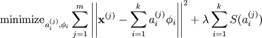
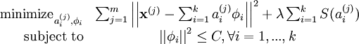

# 稀疏编码(未完成)

稀疏编码算法是一种无监督学习方法, 它用来寻找一组“超完备”基向量来更高效地表示样本数据.

稀疏编码算法的目的就是找到一组**基向量 ** , 使得我们能将输入向量  表示为这些基向量的线性组合：
$$
\mathbf{x} =\sum_{i=1}^k a_i \phi_{i}
$$
虽然形如主成分分析技术（PCA）能使我们方便地找到一组“完备”基向量, 但是这里我们想要做的是找到一组**“超完备”**基向量来表示输入向量  （也就是说, *k* > *n*). 超完备基的好处是它们能更有效地找出隐含在输入数据内部的结构与模式.

然而, 对于超完备基来说, 系数 a~i~ 不再由输入向量  唯一确定. 因此, 在稀疏编码算法中, 我们另加了一个评判标准**“稀疏性”**来解决因超完备而导致的退化(degeneracy)问题.

这里, 我们把“稀疏性”定义为：只有很少的几个非零元素或只有很少的几个远大于零的元素.

> (一个不太恰当的类比就是方程组求解中, 求解三个未知数, 但只有两个方程, 所以求得的未知数不唯一), 所以要引入sparsity, 方法就是加正则.

对于一组输入向量, **我们只想有尽可能少的几个系数远大于零**. 选择使用具有稀疏性的分量来表示我们的输入数据是有原因的, 因为绝大多数的感官数据, 比如自然图像, 可以被表示成少量基本元素的叠加, 在图像中这些基本元素可以是面或者线. 同时, 比如与初级视觉皮层的类比过程也因此得到了提升.

> 注意, 这里迭代的不只是 $\phi_{i}$ , 还有$a_{i}^{(j)}$

虽然“稀疏性”的最直接测度标准是 "*L*0" 范式(), 但这是不可微的, 而且通常很难进行优化. 在实际中, 稀疏代价函数 *S*(.) 的普遍选择是*L*1 范式代价函数  及对数代价函数  .

第一项是reconstruction误差, 第二项是正则.

此外, 很有可能因为减小 $a_i $或增加  至很大的常量, 使得稀疏惩罚变得非常小(如果要保证a足够小, 那么让basis vector phi足够大也能达到正则sparsity的目的, 这是我们不想要的). 为防止此类事件发生, 我们将限制  要小于某常量 *C* .

包含了**限制条件**的稀疏编码代价函数的完整形式如下：

使用稀疏编码算法学习基向量集的方法, 是由两个独立的优化过程组合起来的.

* 第一个是逐个使用训练样本  来优化系数 
* 第二个是一次性处理多个样本对基向量  进行优化

如果使用 *L*1 范式作为稀疏惩罚函数, 对  的学习过程就简化为求解 **由 *L*1 范式正则化的最小二乘法问题, 这个问题函数在域  内为凸**, 已经有很多技术方法来解决这个问题(诸如CVX之类的凸优化软件可以用来解决L1正则化的最小二乘法问题). 如果 *S*(.) 是可微的, 比如是对数惩罚函数, 则可以采用基于梯度算法的方法, 如共轭梯度法.

用 *L*2 范式约束来学习基向量, 同样可以简化为一个**带有二次约束的最小二乘问题, 其问题函数在域  内也为凸**. 标准的凸优化软件(如CVX)或其它迭代方法就可以用来求解 , 虽然已经有了更有效的方法, 比如求解拉格朗日对偶函数(Lagrange dual).

根据前面的的描述, **稀疏编码是有一个明显的局限性的, 这就是即使已经学习得到一组基向量, 如果为了对新的数据样本进行“编码”, 我们必须再次执行优化过程来得到所需的系数. **这个显著的“实时”消耗意味着, 即使是在测试中, 实现稀疏编码也需要高昂的计算成本, 尤其是与典型的前馈结构算法相比.
