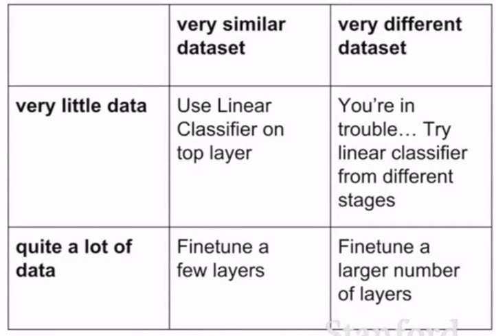

## 迁移学习

### 主要含义

> https://www.zhihu.com/question/49534423
>
> https://github.com/jindongwang/transferlearning

小数据集的时候容易过拟合，正则化和迁移学习都可以用来解决，使得不需要太大的数据集亦可以训练卷积网络。

> 举个例子，假设今天老板给你一个新的数据集，让你做一下图片分类，这个数据集是关于Flowers的。问题是，数据集中flower的类别很少，数据集中的数据也不多，你发现从零训练开始训练CNN的效果很差，很容易过拟合。怎么办呢，于是你想到了使用Transfer Learning，用别人已经训练好的Imagenet的模型来做。
>
> 做的方法有很多：
>
> 1. 把Alexnet里卷积层最后一层输出的特征拿出来，然后直接用SVM分类。这是Transfer Learning，因为你用到了Alexnet中已经学到了的**“知识”**。
> 2. 把Vggnet卷积层最后的输出拿出来，用贝叶斯分类器分类。思想基本同上。
> 3. 甚至你可以把Alexnet、Vggnet的输出拿出来进行组合，自己设计一个分类器分类。这个过程中你不仅用了Alexnet的“知识”，也用了Vggnet的“知识”。
> 4. 最后，你也可以直接使用**fine-tune**这种方法，在Alexnet的基础上，重新加上全连接层，再去训练网络。
>
> 综上，Transfer Learning关心的问题是：什么是“知识”以及如何更好地运用之前得到的“知识”。这可以有很多方法和手段。而fine-tune只是其中的一种手段。

> Transfer learning可以看成是一套完整的体系，是一种处理流程
> 目的是为了不抛弃从之前数据里得到的有用信息，也是**为了应对新进来的大量数据的缺少标签或者由于数据更新而导致的标签变异情况**

迁移学习(transfer learning)通俗来讲，就是**运用已有的知识来学习新的知识，核心是找到已有知识和新知识之间的相似性**，用成语来说就是举一反三。<u>由于直接对目标域从头开始学习成本太高，我们故而转向运用已有的相关知识来辅助尽快地学习新知识</u>。

比如，已经会下中国象棋，就可以类比着来学习国际象棋；已经会编写Java程序，就可以类比着来学习C#；已经学会英语，就可以类比着来学习法语；等等。

世间万事万物皆有共性，如何合理地找寻它们之间的相似性，进而利用这个桥梁来帮助学习新知识，是迁移学习的核心问题。

回应开头，对于迁移学习而言，利用已有的学习基础，可以应对某些情况下小样本的新的数据集的训练应用。

## 细节

具体地，在迁移学习中，我们已有的知识叫做**源域(source domain)**，要学习的新知识叫**目标域(target domain)**。**迁移学习研究如何把源域的知识迁移到目标域上**。

特别地，在机器学习领域中，迁移学习研究如何将已有模型应用到新的不同的、但是有一定关联的领域中。传统机器学习在应对数据的分布、维度，以及模型的输出变化等任务时，模型不够灵活、结果不够好，而迁移学习放松了这些假设。在**数据分布、特征维度以及模型输出变化条件下**，有机地利用源域中的知识来对目标域更好地建模。另外，在**有标定数据缺乏的情况下**，迁移学习可以很好地利用相关领域有标定的数据完成数据的标定。

图2 迁移学习与传统机器学习的不同。(a)传统机器学习对不同的学习任务建立不同的模型，(b)迁移学习利用源域中的数据将知识迁移到目标域，完成模型建立。插图来自：Sinno Jialin Pan and Qiang Yang, A survey on transfer learning. IEEE TKDE 2010.

迁移学习按照*学习方式*可以分为**基于样本的迁移，基于特征的迁移，基于模型的迁移，以及基于关系的迁移**。

1. 基于样本的迁移：通过对源域中**有标定样本的加权利用**完成知识迁移；
2. 基于特征的迁移：通过将源域和目标域**映射到相同的空间**（或者将其中之一映射到另一个的空间中）并**最小化源域和目标域的距离**来完成知识迁移；
3. 基于模型的迁移：将源域和目标域的模型与样本**结合起来调整模型的参数**；
4. 基于关系的迁移：则通过在源域中学习概念之间的关系，然后将其**类比到目标域中**，完成知识的迁移。

理论上，任何领域之间都可以做迁移学习。但是，**如果源域和目标域之间相似度不够，迁移结果并不会理想，出现所谓的负迁移情况**。比如，一个人会骑自行车，就可以类比学电动车；但是如果类比着学开汽车，那就有点天方夜谭了。<u>如何找到相似度尽可能高的源域和目标域，是整个迁移过程最重要的前提</u>。

> 负迁移指的是，在源域上学习到的知识，对于目标域上的学习产生**负面作用**。
>
> 所以，产生负迁移的原因主要有：
>
> 1. 源域和目标域压根不相似，谈何迁移？------数据问题
> 2. 源域和目标域是相似的，但是，迁移学习方法不够好，没找到可迁移的成分。 --------方法问题
>
> 因此，在实际应用中，找到**合理的相似性**，并且选择或开发**合理的迁移学习方法**，能够避免负迁移现象。

迁移学习方面，代表人物有香港科技大学的Qiang Yang教授，南洋理工大学的Sinno Jialin Pan，以及第四范式的CEO戴文渊等。代表文献是Sinno Jialin Pan和Qiang Yang的A survey on transfer learning。

> 但是，随着研究的深入，已经有新的研究成果在逐渐克服负迁移的影响。杨强教授团队2015在数据挖掘领悟顶级会议KDD上发表了**传递迁移学习**文章《Transitive transfer learning》，提出了传递迁移学习的思想。传统迁移学习就好比是踩着一块石头过河，传递迁移学习就好比是踩着连续的两块石头。更进一步，杨强教授团队在2017年人工智能领域顶级会议AAAI上发表了远领域迁移学习的文章《Distant domain transfer learning》，可以用人脸来识别飞机！这就好比是踩着一连串石头过河。
>
> 这些研究的意义在于，**传统迁移学习只有两个领域足够相似才可以完成，而当两个领域不相似时，传递迁移学习却可以利用处于这两个领域之间的若干领域，将知识传递式的完成迁移**。这个是很有意义的工作，可以视为解决负迁移的有效思想和方法。可以预见在未来会有更多的应用前景。