# RNN(Vanilla/Simple/Elman RNN)

## 前言

深度学习主要思想为统计不变性（最主要的是权重共享，大大降低神经网络中的向量维数，一定程度上可以避免过拟合同时也能降低计算量），表现在空间上权重共享上体现为CNN（Convolutional Neural Network），时间上权重共享体现为RNN（Recurrent Neural Networks）。

在机器学习领域中，**通过加法门和乘法门管理模型的梯度流是非常重要的,这也是RNN等给我们的启示**，比如ResNet。同样在递归网络中也是很普遍。

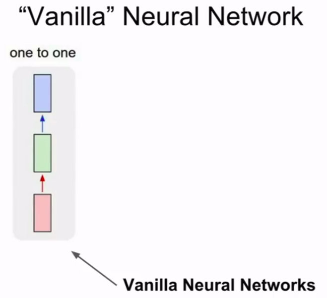

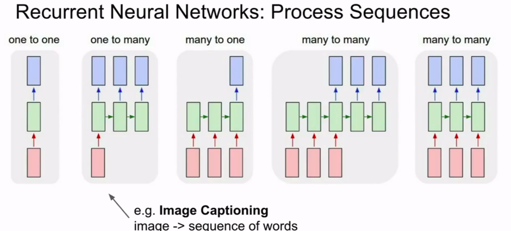

对不同的应用而言，网络的对应关系主要有以上几种。

如最普通的一对一，一般的基础架构都有。

一对多，如输入一张图，输出语言序列。

多对一，如输入一段话，输出文字的情感属性。

多对多，希望输入输出尺寸都是可变的，可能在机器翻译中碰到类似问题。

还有一种多对多就是输入是可变长度，但是要对输入的每一个变量都要作出决策。如对视频分析，每一帧都要做出决策。

## 简介

RNN就是用于处理大小可变的有序数据的一类模型。即使对于固定大小输入输出，也很有用。

在传统的神经网络模型中，是从输入层到隐含层再到输出层，层与层之间是全连接的，每层之间的节点是无连接的。但是这种普通的神经网络对于很多问题却无能无力。例如，你要预测句子的下一个单词是什么，一般需要用到前面的单词，因为一个句子中前后单词并不是独立的。

RNNs之所以称为循环神经网路，即**一个序列当前的输出与前面的输出也有关**。

具体的表现形式为**网络会对前面的信息进行记忆并应用于当前输出的计算中**，即隐藏层之间的节点不再无连接而是有连接的，并且隐藏层的输入不仅包括输入层的输出还包括上一时刻隐藏层的输出。理论上，RNNs能够对任何长度的序列数据进行处理。但是在实践中，为了降低复杂性往往假设当前的状态只与前面的几个状态相关。


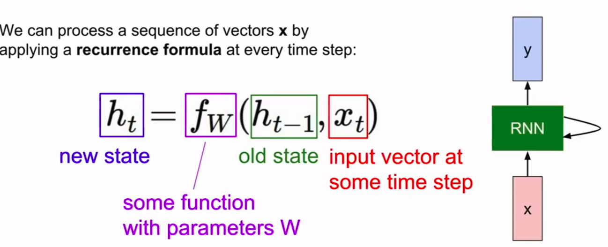

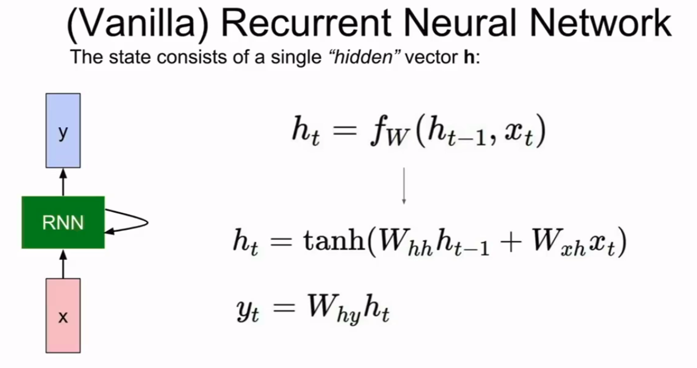

在第一时刻，有初始隐藏层状态$h_0=0$，与目前的$x$输入到$f_W$中，计算得出下一个隐藏层状态$h_1$，如此往复，直到用完了输入序列中的$x_t$。

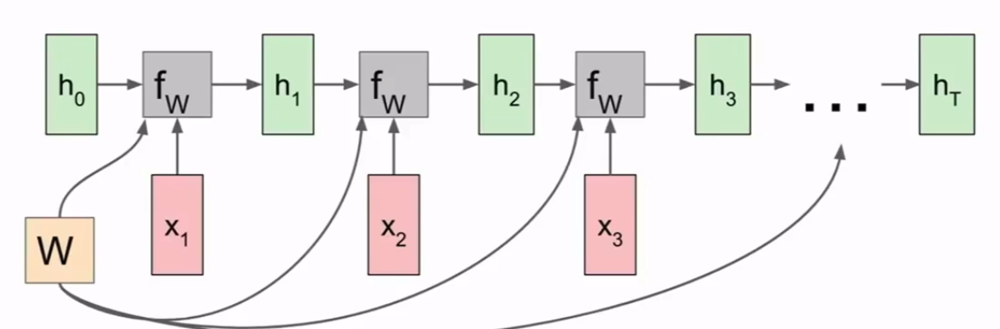

可以看到，始终共享着参数W。最终dW得到的是所有时刻下dW的总和。

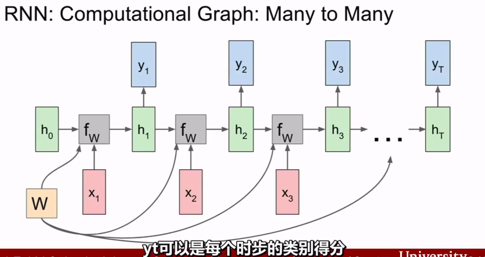

输出的$y_t$可以看做是每个时刻下的类别得分或者其他的含义。

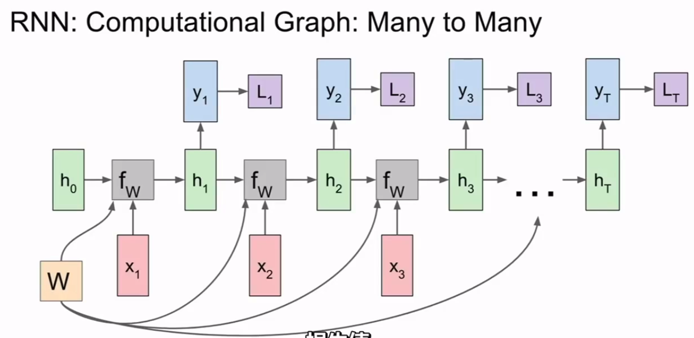

可以计算得到每个时刻下，与输出相对应的损失值。通常是softmax之类的。需要序列在每个时步下都有与之对应真实标签。

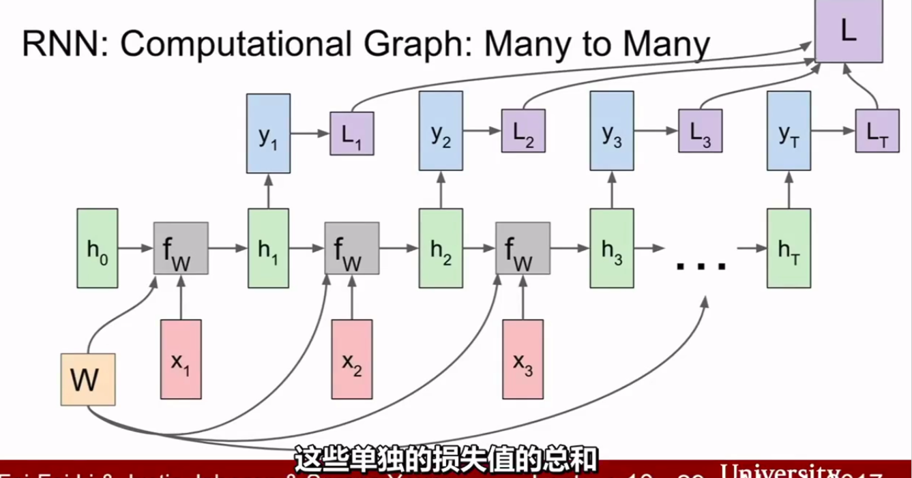

最终损失是所有单独损失值的总和。计算梯度的时候，分支节回溯，总和即为dW。

### 用于多对一

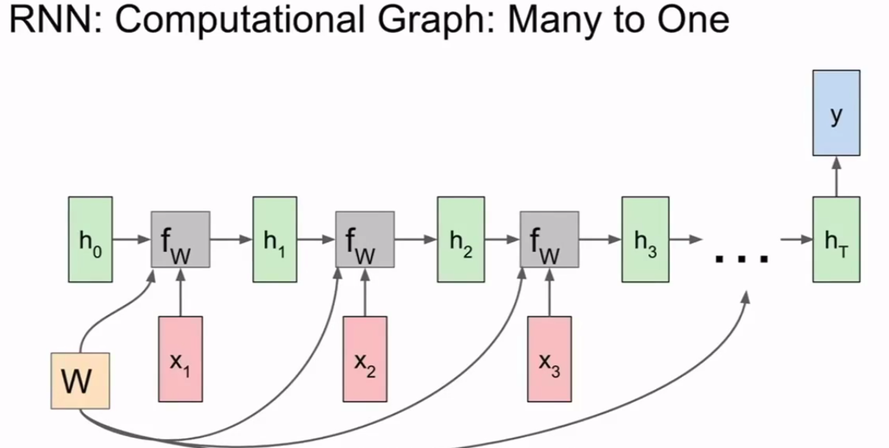

通常会根据网络最终的隐藏层状态作出决策，因为最终的隐藏层状态，整合了序列中包含的所有情况。

### 用于一对多

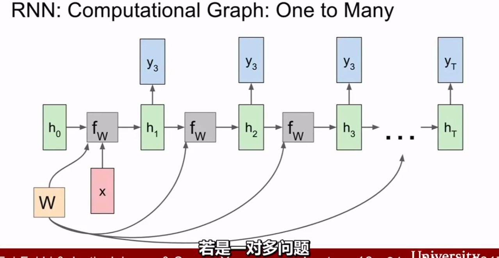

固定长度的输入，非固定长度的输出。

## 细节


我们想象现在有一组序列数据 data 0,1,2,3. 在当预测 result0 的时候,我们基于的是 data0, 同样在预测其他数据的时候, 我们也都只单单基于单个的数据. 每次使用的神经网络都是同一个 NN. 不过这些数据是有关联 顺序的 , 就像在厨房做菜, 酱料 A要比酱料 B 早放, 不然就串味了. 所以普通的神经网络结构并**不能让 NN 了解这些数据之间的关联.**


那我们如何让数据间的关联也被 NN 加以分析呢? 想想我们人类是怎么分析各种事物的关联吧, 最基本的方式,就是**记住之前发生的事情**. 那我们让神经网络也具备这种记住之前发生的事的能力.

在分析 Data0 的时候, 我们把分析结果存入记忆. 然后当分析 data1的时候, NN会产生新的记忆, 但是新记忆和老记忆是没有联系的. 我们就简单的把老记忆调用过来, 一起分析. 如果继续分析更多的有序数据 , RNN就会把之前的记忆都累积起来, 一起分析.


我们再重复一遍刚才的流程, 不过这次是以加入一些数学方面的东西. 每次 RNN 运算完之后都会产生一个对于当前状态的描述 , state. 我们用简写$ s( t)$ 代替, 然后这个 RNN开始分析$ x(t+1)$ , 他会根据$ x(t+1)$产生$s(t+1)$, **不过此时$ y(t+1) $是由$ s(t) $和$ s(t+1) $共同创造的**. 所以我们通常看到的 RNN 也可以表达成这种样子(最右边的图).

## 应用

RNN 的形式不单单这有这样一种, 他的结构形式很自由. 如果用于分类问题, 比如说一个人说了一句话, 这句话带的感情色彩是积极的还是消极的. 那我们就可以用只有最后一个时间点输出判断结果的RNN.

又或者这是图片描述 RNN, 我们只需要一个 X 来代替输入的图片, 然后生成对图片描述的一段话.

或者是语言翻译的 RNN, 给出一段英文, 然后再翻译成中文.

有了这些不同形式的 RNN, RNN 就变得强大了. 有很多有趣的 RNN 应用. 比如之前提到的, 让 RNN 描述照片. 让 RNN 写学术论文, 让 RNN 写程序脚本, 让 RNN 作曲. 我们一般人甚至都不能分辨这到底是不是机器写出来的.

RNNs已经被在实践中证明对NLP是非常成功的。如词向量表达、语句合法性检查、词性标注等。在RNNs中，目前使用最广泛最成功的模型便是[LSTMs(Long Short-Term Memory，长短时记忆模型)模型](https://en.wikipedia.org/wiki/Long_short_term_memory)，该模型通常比vanilla RNNs能够更好地对长短时依赖进行表达，该模型相对于一般的RNNs，只是在隐藏层做了手脚。

## 传播

对于RNN是的训练和对传统的ANN训练一样。同样使用BP误差反向传播算法，不过有一点区别。

RNN可以采用BPTT（Back-Propagation Through Time）算法进行学习。BPTT和BP算法类似，都是基于梯度的训练方法。将RNN展开之后，就可以使用与训练带BP的前馈神经网络类似的方法进行训练。有一点需要注意的是，在展开的RNN中，每一层隐藏层实际上是相同的（只是在不同时刻的副本），也就是说，它们最后得到的参数必须是一致的,**参数W,U,V是共享的**，而传统神经网络却不是的。在训练过程中，不同时刻的隐藏层的参数可能会不一致，最后可以将它们的平均数作为模型的参数。

### 定义结构

> https://www.cnblogs.com/pinard/p/6509630.html

RNN模型有比较多的变种，这里介绍最主流的RNN模型结构如下：


上图中左边是RNN模型没有按时间展开的图，如果按时间序列展开，则是上图中的右边部分。我们重点观察右边部分的图。

这幅图描述了在序列索引号$t$附近RNN的模型。其中：

1. $x(t)$代表在序列索引号$t$时训练样本的输入。同样的，$x(t−1)$和$x(t+1)$代表在序列索引号$t−1$和$t+1$时训练样本的输入。
2. $h(t)$代表在序列索引号$t$时模型的隐藏状态。$h(t)$由$x(t)$和$h(t−1)$共同决定。
3. $o(t)$代表在序列索引号$t$时模型的输出。$o(t)$只由模型当前的隐藏状态$h(t)$决定。
4. $L(t)$代表在序列索引号$t$时模型的损失函数。
5. $y(t)$代表在序列索引号$t$时训练样本序列的真实输出。
6. $U,W,V$这三个矩阵是我们的模型的线性关系参数，它在整个RNN网络中是共享的，这点和DNN很不相同。 也正因为是共享了，它体现了RNN的模型的“循环反馈”的思想。　　

### 前向传播

有了上面的模型，RNN的前向传播算法就很容易得到了。对于任意一个序列索引号$t$，我们隐藏状态$h^{(t)}$由$x^{(t)}$和$h^{(t-1)}$得到：$h^{(t)}=σ(z^{(t)})=σ(Ux^{(t)}+Wh^{(t−1)}+b)$

其中$σ$为RNN的激活函数，一般为$tanh$，$b$为线性关系的偏倚。

序列索引号$t$时模型的输出$o^{(t)}$的表达式比较简单：$o^{(t)}=Vh^{(t)}+c$

在最终在序列索引号$t$时我们的**预测输出**为：$\hat{y}^{(t)}=σ(o^{(t)})$

**通常由于RNN是识别类的分类模型**，所以上面这个激活函数一般是softmax。

通过损失函数$L^{(t)}$，比如对数似然损失函数，我们可以量化模型在当前位置的损失，**即$\hat{y}^{(t)}$和$y^{(t)}$的差距**。

> 对数似然损失函数：$L(Y,P(Y|X))=−logP(Y|X)$
>
> > http://www.csuldw.com/2016/03/26/2016-03-26-loss-function/
>
> 这里可以表示为：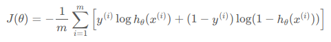
>
> 而这里的$h_\theta(x^{(i)})$就相当于$\hat{y}^{(t)}$？对！

### 反向传播

有了RNN前向传播算法的基础，就容易推导出RNN反向传播算法的流程了。

RNN反向传播算法的思路和DNN是一样的，即通过梯度下降法一轮轮的迭代，得到合适的RNN模型参数$U,W,V,b,c$。

由于我们是**基于时间反向传播**，所以RNN的反向传播有时也叫做**BPTT(back-propagation through time)**。当然这里的BPTT和DNN也有很大的不同点，即**这里所有的$U,W,V,b,c$在序列的各个位置是共享的**，反向传播时我们更新的是相同的参数。

为了简化描述，这里的损失函数我们为对数损失函数，输出的激活函数为softmax函数，隐藏层的激活函数为$tanh$函数。对于RNN，由于我们在序列的每个位置都有损失函数，因此最终的损失$L=∑_{t=1}^{τ}L(t)$.

其中$V,c$的梯度计算是比较简单的。

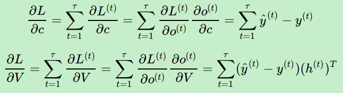

对于第一式，每个$L^{(t)}$都只与相同时期的$o^{(t)}$关联，所以对于每个$L^{(t)}$只有一条路到$c$。

> 1. 这里的第一式的最后是如何得出来的？
>
>     对于逻辑回归问题，有$h_\theta(x)=\frac{1}{1+e^{-\theta^Tx}}=P(y=1|x;\theta)$，以及上面提到的$J(\theta)$损失函数。对应于这里的问题，使用softmax激活函数，从二分类角度理解，就是logistic函数，有  
>
>     $$\hat{y}^{(t)}=σ(o^{(t)})=σ(Vh^{(t)}+c)=\frac{e^{Vh^{(t)}+c}}{\sum_t e^{Vh^{(t)}+c}}=>p(y^{(t)}=1|o^{(t)};\theta)$$ 
>
>     则对$\frac{\part}{\part c}$以及$\frac{\part}{\part V}$而言，就是如同logistic函数的损失函数对于$\theta_0\&\theta_j$的求导。
>
>     结果就是预测值与真实值的差值，以及多出来的一项$h^{(t)}$。
>
> 2. 最后的那个$T$是矩阵转置.
>
> 3. **从多分类角度理解softmax对数似然损失导数**：
>
>    在现有的DNN模型中，我们可以将输出层第i个神经元的激活函数定义为如下形式：
>
>    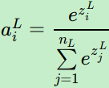
>
>    其中，$n_L$是输出层第$L$层的神经元个数，或者说我们的分类问题的类别数。很容易看出，所有的$a_i^L$都是在(0,1) 之间的数字，而$∑_{j=1}^{n_L}e^{z^L_j}$作为归一化因子保证了所有的和为1。
>
>    损失函数对应为：
>
>    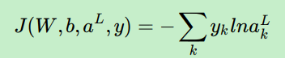
>
>    其中$y_k$的取值为0或者1，如果某一训练样本的输出为第$i$类，则$y_i=1$,其余的$j≠i$都有$y_j=0$。由于每个样本只属于一个类别，所以这个对数似然函数可以简化为：
>
>    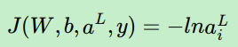
>
>    其中$i$即为训练样本真实的类别序号。
>
>    可见损失函数只和真实类别对应的输出有关，这样假设真实类别是第$i$类，则其他不属于第$i$类序号对应的神经元的梯度导数直接为0。对于真实类别第$i$类，他对应的第$j$个$w$链接$w_{ij}^L$对应的梯度计算为：
>
>    （要注意，这里的$a_j^{L-1}$，表示本层的输入，相当于就是输入$x_i$）
>
>    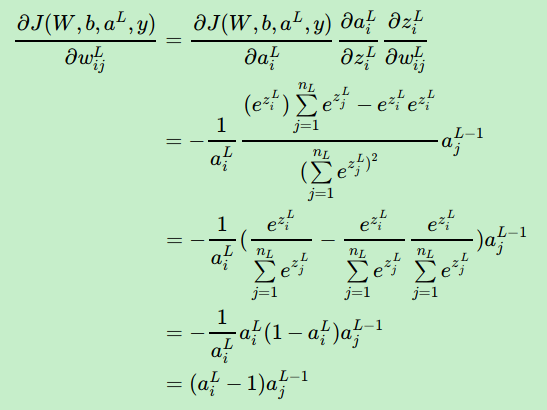
>
>    同样的可以得到$b_i^L$的梯度表达式为：
>
>    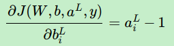
>

但是$W,U,b$的梯度计算就比较的复杂了，因为一来要涉及到很多的支路，二来要考虑到数个函数的导数。


从RNN的模型可以看出，在反向传播时，在在某一序列位置$t$的梯度损失由**当前位置的输出对应的梯度损失**和序列索引**位置$t+1$时的梯度损失**两部分共同决定。因为$h^{(t+1)}$和$h^{(t)}$有关。

对于$W$在某一序列位置$t$的梯度损失需要反向传播一步步的计算。

* 序列索引$t$位置的隐藏状态的梯度为：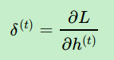

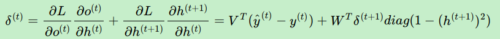

> 这里要注意第二个因式。
>
> $h^{(t)}=σ(z^{(t)})=σ(Ux^{(t)}+Wh^{(t−1)}+b)$——在此基础上考虑，再结合$tanh​$的倒数，大体也可理解。
>
> 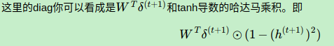
>
> ```python
> x, prev_h, Wx, Wh, h_raw, next_h = cache
> # h_raw 表示x与h的线性组合,也就是tanh的参数
> dh_raw = (1 - next_h * next_h) * dnext_h
> dprev_h = dh_raw.dot(Wh.T)
> ```
>
>

* 最后一个位置的梯度：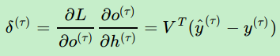

由此可得：

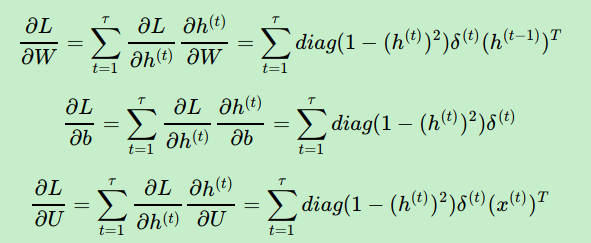

需要意识到的是，在vanilla RNNs训练中，[BPTT无法解决长时依赖问题](http://www.jmlr.org/proceedings/papers/v28/pascanu13.pdf)(即当前的输出与前面很长的一段序列有关，一般超过十步就无能为力了)，因为BPTT会带来所谓的梯度消失或梯度爆炸问题(the vanishing/exploding gradient problem)。

下面提到了一种**梯度截断**的方法.

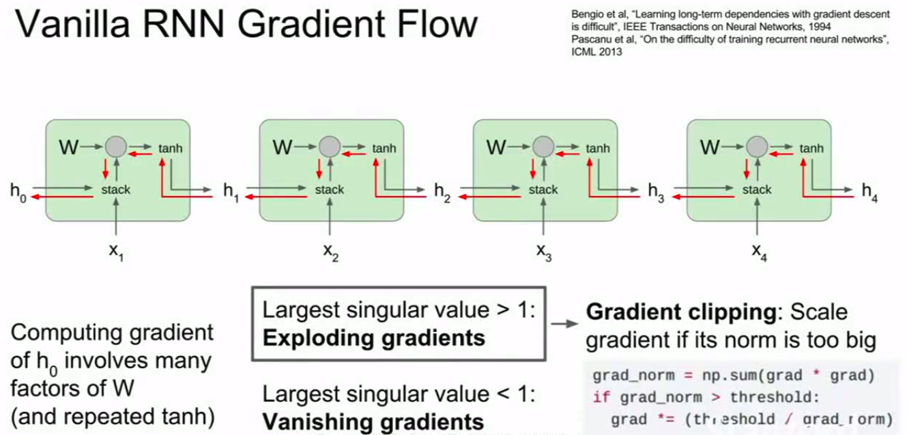

当然，有很多方法去解决这个问题，如LSTMs便是专门应对这种问题的。

> In theory, RNNs are absolutely capable of handling such “long-term dependencies.” A human could carefully pick parameters for them to solve toy problems of this form. Sadly, in practice, RNNs don’t seem to be able to learn them. The problem was explored in depth by [Hochreiter (1991) [German\]](http://people.idsia.ch/~juergen/SeppHochreiter1991ThesisAdvisorSchmidhuber.pdf) and [Bengio, et al. (1994)](http://www-dsi.ing.unifi.it/~paolo/ps/tnn-94-gradient.pdf), who found some pretty fundamental reasons why it might be difficult.

# LSTM( long-short term memory长短期记忆)

今天我们会来聊聊在普通RNN的弊端和为了解决这个弊端而提出的 LSTM 技术. LSTM 是 long-short term memory 的简称, 中文叫做 长短期记忆. 是当下最流行的 RNN 形式之一.

> They were introduced by [Hochreiter & Schmidhuber (1997)](http://www.bioinf.jku.at/publications/older/2604.pdf), and were refined and popularized by many people in following work.They work tremendously well on a large variety of problems, and are now widely used.

## RNN的弊端


之前我们说过, [RNN](https://morvanzhou.github.io/tutorials/machine-learning/ML-intro/2-3-RNN/) 是在有顺序的数据上进行学习的. 为了记住这些数据, RNN 会像人一样产生对先前发生事件的记忆. 不过一般形式的 RNN 就像一个老爷爷, 有时候比较健忘. 为什么会这样呢?


想像现在有这样一个 RNN, 他的输入值是一句话: ‘我今天要做红烧排骨, 首先要准备排骨, 然后…., 最后美味的一道菜就出锅了’, shua ~ 说着说着就流口水了. 

现在请 RNN 来分析, 我今天做的到底是什么菜呢. RNN可能会给出“辣子鸡”这个答案. 由于判断失误, RNN就要开始学习 这个长序列 X 和 ‘红烧排骨’ 的关系 , 而RNN需要的关键信息 ”红烧排骨”却出现在句子开头。


再来看看 RNN是怎样学习的吧. 红烧排骨这个信息原的记忆要进过长途跋涉才能抵达最后一个时间点. 然后我们得到误差, 而且在 **反向传递** 得到的误差的时候, 他在每一步都会**乘以一个自己的参数 W.** 如果这个 W 是一个小于1 的数, 比如0.9. 这个0.9 不断乘以误差, 误差传到初始时间点也会是一个接近于零的数, **所以对于初始时刻, 误差相当于就消失了**. 我们把这个问题叫做**梯度消失或者梯度弥散 Gradient vanishing**. 

反之如果 W 是一个大于1 的数, 比如1.1 不断累乘, 则到最后变成了无穷大的数, RNN被这无穷大的数撑死了, 这种情况我们叫做**梯度爆炸, Gradient exploding**. 

这就是**普通 RNN 没有办法回忆起久远记忆**的原因.

## LSTM如何避免梯度爆炸和消失

> https://www.zhihu.com/question/34878706
>
> https://zhuanlan.zhihu.com/p/28749444
>
> https://zhuanlan.zhihu.com/p/28687529


现在假设我们我们的时间序列只有三段，t1，t2，t3。

假设在t=3时刻，损失函数为  。

则对于一次训练任务的损失函数为  ，即每一时刻损失值的累加。

使用随机梯度下降法训练RNN其实就是对  、  、  以及  求偏导，并不断调整它们以使L尽可能达到最小的过程。

我们只对t3时刻的  求偏导（其他时刻类似）：


![\frac{\partial{L_{3}}}{\partial{W_{x}}}=\frac{\partial{L_{3}}}{\partial{O_{3}}}\frac{\partial{O_{3}}}{\partial{S_{3}}}\frac{\partial{S_{3}}}{\partial{W_{x}}}+\frac{\partial{L_{3}}}{\partial{O_{3}}}\frac{\partial{O_{3}}}{\partial{S_{3}}}\frac{\partial{S_{3}}}{\partial{S_{2}}}\frac{\partial{S_{2}}}{\partial{W_{x}}}+\frac{\partial{L_{3}}}{\partial{O_{3}}}\frac{\partial{O_{3}}}{\partial{S_{3}}}\frac{\partial{S_{3}}}{\partial{S_{2}}}\frac{\partial{S_{2}}}{\partial{S_{1}}}\frac{\partial{S_{1}}}{\partial{W_{x}}}](https://www.zhihu.com/equation?tex=%5Cfrac%7B%5Cpartial%7BL_%7B3%7D%7D%7D%7B%5Cpartial%7BW_%7Bx%7D%7D%7D%3D%5Cfrac%7B%5Cpartial%7BL_%7B3%7D%7D%7D%7B%5Cpartial%7BO_%7B3%7D%7D%7D%5Cfrac%7B%5Cpartial%7BO_%7B3%7D%7D%7D%7B%5Cpartial%7BS_%7B3%7D%7D%7D%5Cfrac%7B%5Cpartial%7BS_%7B3%7D%7D%7D%7B%5Cpartial%7BW_%7Bx%7D%7D%7D%2B%5Cfrac%7B%5Cpartial%7BL_%7B3%7D%7D%7D%7B%5Cpartial%7BO_%7B3%7D%7D%7D%5Cfrac%7B%5Cpartial%7BO_%7B3%7D%7D%7D%7B%5Cpartial%7BS_%7B3%7D%7D%7D%5Cfrac%7B%5Cpartial%7BS_%7B3%7D%7D%7D%7B%5Cpartial%7BS_%7B2%7D%7D%7D%5Cfrac%7B%5Cpartial%7BS_%7B2%7D%7D%7D%7B%5Cpartial%7BW_%7Bx%7D%7D%7D%2B%5Cfrac%7B%5Cpartial%7BL_%7B3%7D%7D%7D%7B%5Cpartial%7BO_%7B3%7D%7D%7D%5Cfrac%7B%5Cpartial%7BO_%7B3%7D%7D%7D%7B%5Cpartial%7BS_%7B3%7D%7D%7D%5Cfrac%7B%5Cpartial%7BS_%7B3%7D%7D%7D%7B%5Cpartial%7BS_%7B2%7D%7D%7D%5Cfrac%7B%5Cpartial%7BS_%7B2%7D%7D%7D%7B%5Cpartial%7BS_%7B1%7D%7D%7D%5Cfrac%7B%5Cpartial%7BS_%7B1%7D%7D%7D%7B%5Cpartial%7BW_%7Bx%7D%7D%7D)

![\frac{\partial{L_{3}}}{\partial{W_{s}}}=\frac{\partial{L_{3}}}{\partial{O_{3}}}\frac{\partial{O_{3}}}{\partial{S_{3}}}\frac{\partial{S_{3}}}{\partial{W_{s}}}+\frac{\partial{L_{3}}}{\partial{O_{3}}}\frac{\partial{O_{3}}}{\partial{S_{3}}}\frac{\partial{S_{3}}}{\partial{S_{2}}}\frac{\partial{S_{2}}}{\partial{W_{s}}}+\frac{\partial{L_{3}}}{\partial{O_{3}}}\frac{\partial{O_{3}}}{\partial{S_{3}}}\frac{\partial{S_{3}}}{\partial{S_{2}}}\frac{\partial{S_{2}}}{\partial{S_{1}}}\frac{\partial{S_{1}}}{\partial{W_{s}}}](https://www.zhihu.com/equation?tex=%5Cfrac%7B%5Cpartial%7BL_%7B3%7D%7D%7D%7B%5Cpartial%7BW_%7Bs%7D%7D%7D%3D%5Cfrac%7B%5Cpartial%7BL_%7B3%7D%7D%7D%7B%5Cpartial%7BO_%7B3%7D%7D%7D%5Cfrac%7B%5Cpartial%7BO_%7B3%7D%7D%7D%7B%5Cpartial%7BS_%7B3%7D%7D%7D%5Cfrac%7B%5Cpartial%7BS_%7B3%7D%7D%7D%7B%5Cpartial%7BW_%7Bs%7D%7D%7D%2B%5Cfrac%7B%5Cpartial%7BL_%7B3%7D%7D%7D%7B%5Cpartial%7BO_%7B3%7D%7D%7D%5Cfrac%7B%5Cpartial%7BO_%7B3%7D%7D%7D%7B%5Cpartial%7BS_%7B3%7D%7D%7D%5Cfrac%7B%5Cpartial%7BS_%7B3%7D%7D%7D%7B%5Cpartial%7BS_%7B2%7D%7D%7D%5Cfrac%7B%5Cpartial%7BS_%7B2%7D%7D%7D%7B%5Cpartial%7BW_%7Bs%7D%7D%7D%2B%5Cfrac%7B%5Cpartial%7BL_%7B3%7D%7D%7D%7B%5Cpartial%7BO_%7B3%7D%7D%7D%5Cfrac%7B%5Cpartial%7BO_%7B3%7D%7D%7D%7B%5Cpartial%7BS_%7B3%7D%7D%7D%5Cfrac%7B%5Cpartial%7BS_%7B3%7D%7D%7D%7B%5Cpartial%7BS_%7B2%7D%7D%7D%5Cfrac%7B%5Cpartial%7BS_%7B2%7D%7D%7D%7B%5Cpartial%7BS_%7B1%7D%7D%7D%5Cfrac%7B%5Cpartial%7BS_%7B1%7D%7D%7D%7B%5Cpartial%7BW_%7Bs%7D%7D%7D)

可以看出对于  求偏导并没有长期依赖，但是对于  求偏导，会随着时间序列产生长期依赖。因为  随着时间序列向前传播，而  又是 的函数。

[RNN梯度消失和爆炸的原因](https://zhuanlan.zhihu.com/p/28687529)这篇文章中提到的RNN结构可以抽象成下面这幅图：


而LSTM可以抽象成这样：


三个×分别代表的就是forget gate，input gate，output gate.

> 这里的LSTM模型公式简化过了.忽略了某些量.

当前的状态 类似与传统RNN 。

将LSTM的状态表达式展开后得：

如果加上激活函数， ![S_{t}=tanh\left[\sigma(W_{f}X_{t}+b_{f})S_{t-1}+\sigma(W_{i}X_{t}+b_{i})X_{t}\right]](https://www.zhihu.com/equation?tex=S_%7Bt%7D%3Dtanh%5Cleft%5B%5Csigma%28W_%7Bf%7DX_%7Bt%7D%2Bb_%7Bf%7D%29S_%7Bt-1%7D%2B%5Csigma%28W_%7Bi%7DX_%7Bt%7D%2Bb_%7Bi%7D%29X_%7Bt%7D%5Cright%5D)

[RNN梯度消失和爆炸的原因](https://zhuanlan.zhihu.com/p/28687529)这篇文章中传统RNN求偏导的过程包含 

> 注意这里,是$tanh'*W_s$,下面同理
>
> 由于可知  ，对于训练过程大部分情况下tanh的导数是小于1的，因为很少情况下会出现 ，如果  也是一个大于0小于1的值，则当t很大时  ，就会趋近于0，和  趋近与0是一个道理。同理当  很大时  就会趋近于无穷，这就是RNN中梯度消失和爆炸的原因。
>
> 由于  ,梯度消失和爆炸的根本原因就是  这一坨，要消除这种情况就需要把这一坨在求偏导的过程中去掉，至于怎么去掉，一种办法就是使  另一种办法就是使  。等于零的情况说明当前cell状态不需要记忆那一层的输入.

对于LSTM同样也包含这样的一项，但是在LSTM中 

LSTM中上式可能就会变成：


因为  ，这样就解决了传统RNN中梯度消失的问题。

>  假设  ，则  的函数图像如下图所示：
>
> 

## LSTM细节

LSTM 就是为了解决这个问题而诞生的. LSTM 和普通 RNN 相比, 多出了三个控制器. (输入控制, 输出控制, 忘记控制). 现在, LSTM RNN 内部的情况是这样.


他多了一个**控制全局的记忆**, 我们用粗线代替. 为了方便理解, 我们把粗线想象成电影或游戏当中的 **主线剧情**. 而原本的 RNN 体系就是 **分线剧情.** 

三个控制器都是在原始的 RNN 体系上, 我们先看**输入方面** , 如果此时的分线剧情对于剧终结果十分重要, 输入控制就会将这个分线剧情按重要程度 写入主线剧情 进行分析. 

再看**忘记方面**, 如果此时的分线剧情更改了我们对之前剧情的想法, 那么忘记控制就会将之前的某些主线剧情忘记, 按比例替换成现在的新剧情. 所以 主线剧情的更新就取决于输入 和忘记 控制. 最后的输出方面, 输出控制会基于目前的主线剧情和分线剧情判断要输出的到底是什么.基于这些控制机制, LSTM 就像延缓记忆衰退的良药, 可以带来更好的结果.

> https://colah.github.io/posts/2015-08-Understanding-LSTMs/
>
> LSTMs are explicitly designed to avoid the long-term dependency problem. Remembering information for long periods of time is practically their default behavior, not something they struggle to learn!
>
> All recurrent neural networks have the form of a chain of repeating modules of neural network. In standard RNNs, this repeating module will have a very simple structure, such as a single tanh layer.
>
> 
>
> LSTMs also have this chain like structure, but the repeating module has a different structure. Instead of having a single neural network layer, **there are four,** interacting(交互) in a very special way.
>
> 
>
> **The key to LSTMs is the cell state**, the horizontal line running through the top of the diagram.
>
> 在每个序列索引位置t时刻向前传播的除了和RNN一样的隐藏状态$h_t$，还多了另一个隐藏状态，如图中上面的长横线。这个隐藏状态我们一般称为细胞状态(Cell State)，记为$C_t$
>
> The cell state is kind of like a conveyor belt(输送带). It runs straight down the entire chain, with only some minor linear interactions. It’s very easy for information to just flow along it unchanged.
>
> 
>
> 除了细胞状态，LSTM图中还有了很多奇怪的结构，这些结构一般称之为门控结构(Gate)。LSTM在在每个序列索引位置t的门一般包括遗忘门，输入门和输出门三种。
>
> **Gates are a way to optionally let information through.** They are composed out of a sigmoid neural net layer and a pointwise multiplication operation.
>
> 
>
> The sigmoid layer outputs numbers between zero and one, **describing how much of each component should be let through.** A value of zero means “let nothing through,” while a value of one means “let everything through!”
>
> An LSTM has three of these gates, to **protect** and **control** the cell state.

## 具体流程

(注意:这里都是元素运算)

1. 第一步要决定从我们的cell state上流过什么信息,这个被sigmoid函数指定的决定调用**遗忘门**.

   **遗忘门（forget gate）**顾名思义，是控制是否遗忘的，在LSTM中即以一定的概率控制是否遗忘上一层的隐藏细胞状态。由于sigmoid的输出f(t)在[0,1]之间，因此这里的输出$f_t$代表了遗忘上一层隐藏细胞状态的概率.其中$W_f,U_f,b_f$为线性关系的系数和偏倚，和RNN中的类似。σ为sigmoid激活函数。

   返回之前的语言模型的例子,基于所有之前的内容来预测下一个词.

   在这样的问题中,cell state可能包含目前主语的性别,因此可能会使用正确的代词.但是当我们看到一个新的主语,我们想要忘记旧主语的性别.

   

2. 下一步是决定我们将要在cell state中存储的新信息,调用**输入门**.

   从图中可以看到输入门由两部分组成,第一部分使用了sigmoid激活函数,第二部分使用了tanh激活函数.

   这个有三步:

   1. sigmoid函数部分,决定更新值.
   2. tanh函数部分创造一个新的候选值向量$\tilde{C}_t$,这个能被添加到state中.

   

   3. 组合这两个结果来更新state

3. 准备更新旧的cell state,$\tilde{C}_t$. 

   通过计算如图的结构,乘以 $f_t$,来决定忘记一些先前的内容,添加$i_t*\tilde{C}_t$作为新的候选值,来控制更新state值.

   In the case of the language model, this is where we'd actually drop the information about the old subject's gender and add the new information, as we decided in the previous steps.

   

4. 决定输出值.

   有了新的隐藏细胞状态$C_t$,我们就可以来看输出门了.输出基于cell state,但是是被处理过后的.

   从图中可以看出，隐藏状态$h_t$的更新由两部分组成，第一部分是$o_t$, 它由上一序列的隐藏状态$h_{t−1}$和本序列数据$x_t$,以及激活函数sigmoid得到,第二部分由隐藏状态$C_t$和tanh激活函数组成.

   1. 利用sigmoid函数决定哪一部分cell state将要输出.
   2. 将cell state通过tanh并与sigmoid输出相乘,以使得只输决定输出的一部分.

   For the language model example, since it just saw a subject(主语), it might want to output information relevant to(与...有关) a verb, in case that's what is coming next. For example, it might output whether the subject is singular or plural, so that we know what form a verb should be conjugated into if that's what follows next.

   

## 前向传播

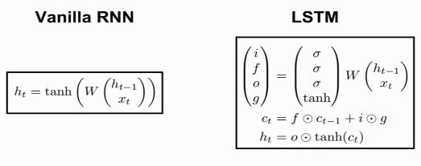

可见,实际中的参数是RNN的四倍.

因为多了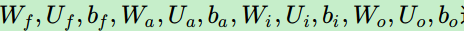这些参数.

### 流程

1. 更新遗忘门输出：

   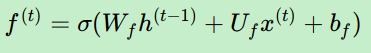

2. 更新输入门两部分输出：(这里的$a^{(t)}$就是图中的$\tilde{C}_t$)

   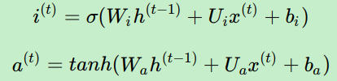

3. 更新细胞状态：

   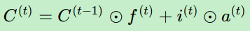

4. 更新输出门输出：

   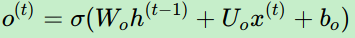

   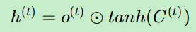

5. 更新当前序列索引预测输出：

   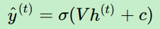

## 反向传播

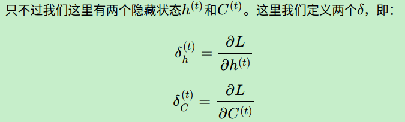

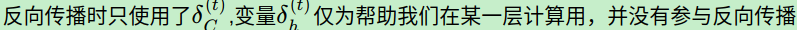

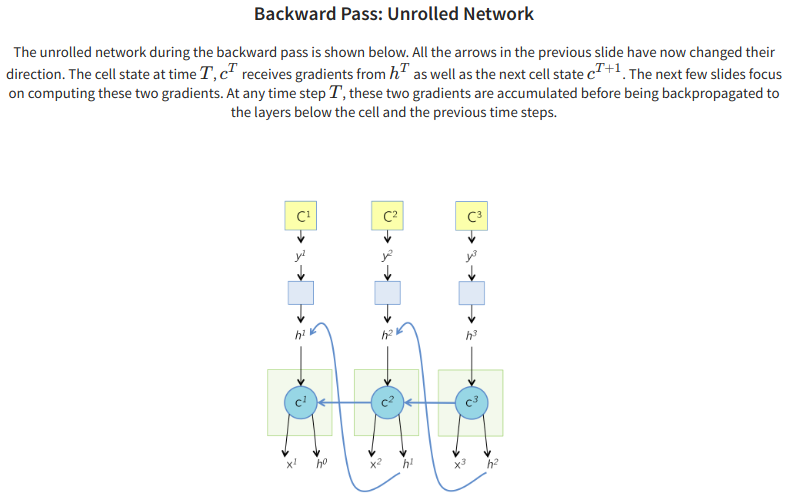

> 这张图大致描述了求导的流程.
>
> 对正向而言,$x^2,h^1,c^1$组合计算出了新的cell state$c^2$,从而得到了新的hidden state$h^2$,进而得到了预测值$y^2$,也就得到了损失函数$C^2$.
>
> 所以反向传播反着走这条路即可.

> https://arunmallya.github.io/writeups/nn/lstm/index.html

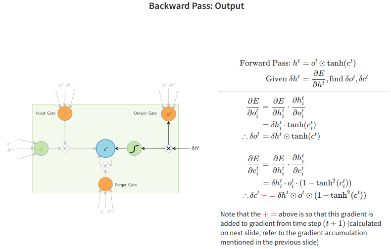

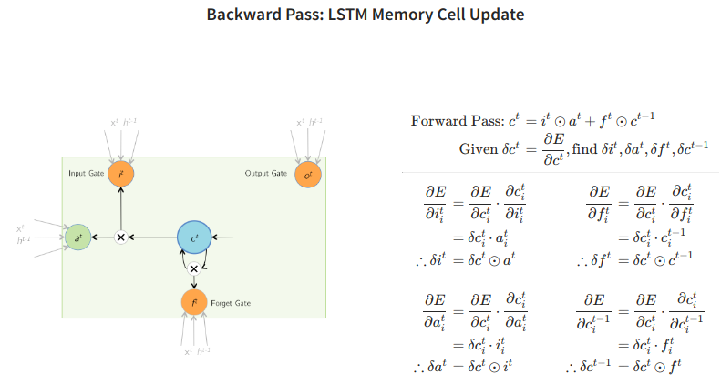

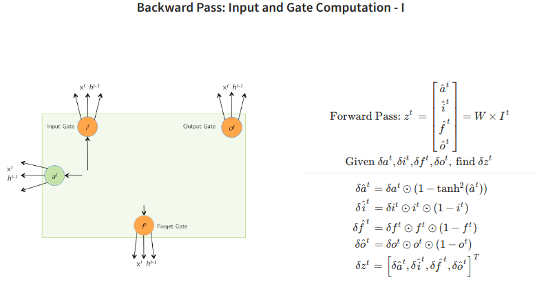

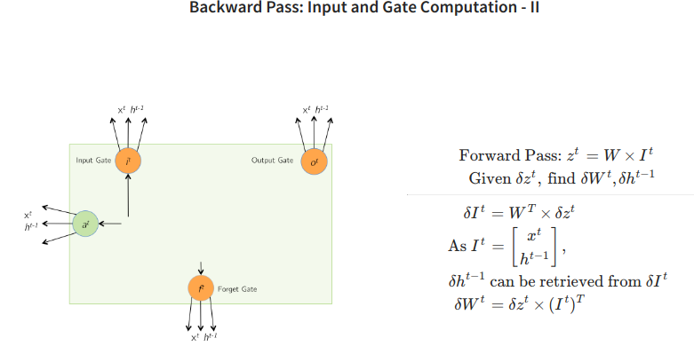

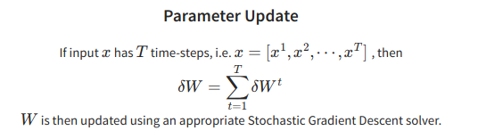


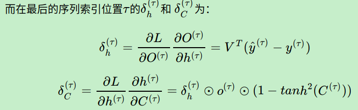

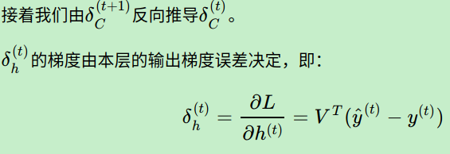

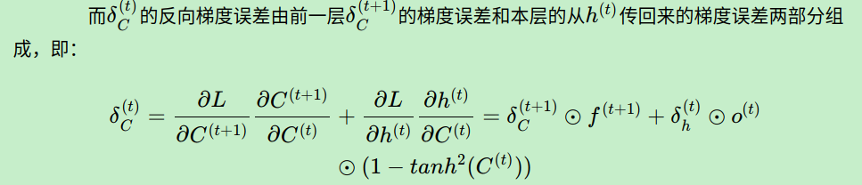

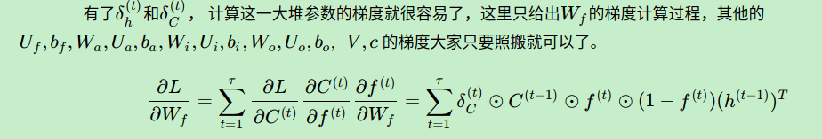


## LSTM变种

> 当然，有些LSTM的结构和上面的LSTM图稍有不同，但是原理是完全一样的。
>
> In fact, it seems like almost every paper involving LSTMs uses a slightly different version. The differences are minor, but it’s worth mentioning some of them.
>
> One popular LSTM variant, introduced by [Gers & Schmidhuber (2000)](ftp://ftp.idsia.ch/pub/juergen/TimeCount-IJCNN2000.pdf), is adding “**peephole connections**.” This means that we let the gate layers look at the cell state.


把旧状态直接引到了各个sigmoid门上.

The above diagram adds peepholes to **all the gates**, but many papers will give **some peepholes** and not others.可见是否全连,没有定论.

另一种版本是使用 **coupled forget and input gates**以替代独立的忘记门和输入门,而是一起做决定.

We only forget when we're going to input something in its place. We only input new values to the state when we forget something older.

输入新的,会忘记一些旧的,忘记一些旧的,会输入一些新的.

> (不甚理解?)
>
> 这里描述输入/忘记的量的衡量是给予系数$f$而言的,应该是这样.输入门部分比例大了,就会降低遗忘门的比例.


A slightly more dramatic variation on the LSTM is the **Gated Recurrent Unit**, or GRU, introduced by [Cho, et al. (2014)](http://arxiv.org/pdf/1406.1078v3.pdf). 

# GRU

它将**遗忘和输入门组合成一个"更新门"**.它还**合并了cell state和hidden state**,并进行了一些其他更改.由此产生的模型比标准LSTM模型简单,并且越来越受欢迎.


These are only a few of the most notable LSTM variants. There are lots of others, like Depth Gated RNNs by [Yao, et al. (2015)](http://arxiv.org/pdf/1508.03790v2.pdf). **There's also some completely different approach to tackling long-term dependencies, like Clockwork RNNs by [Koutnik, et al. (2014)](http://arxiv.org/pdf/1402.3511v1.pdf).**

## Which of these variants is best?

Do the differences matter?

 [Greff, et al. (2015)](http://arxiv.org/pdf/1503.04069.pdf) do a nice comparison of popular variants, finding that they're all about the same.

[Jozefowicz, et al. (2015)](http://jmlr.org/proceedings/papers/v37/jozefowicz15.pdf) tested more than ten thousand RNN architectures, finding some that worked better than LSTMs on certain tasks.

# 应用方式

## 图像标注（Image Caption）

所谓Image Caption，就是从图片中自动生成一段描述性文字，有点类似于我们小时候做过的“看图说话”，十分有趣。对于人来说，Image Caption是简单而自然的一件事，但对于机器来说，这项任务却充满了挑战性。原因在于机器不仅要能检测出图像中的物体，而且要理解物体之间的相互关系，最后还要用合理的语言表达出来。

随着深度学习技术的发展和COCO等图像标注数据集的出现，Image Caption相关的技术得到了快速的发展。

> http://cs231n.stanford.edu/reports/2016/pdfs/362_Report.pdf

### 大致的流程

> 必要的库和辅助配置可见cs231n作业3的**RNN_Captioning.ipynb**

#### 实现必要的函数

##### 实现前向传播与反向传播

因为对于RNN的传播,分为单步和整体,可以分开实现.

##### 词嵌入(Word embedding)的前向与反向

在深度学习系统中，我们通常使用向量来表示单词。词汇表中的每个单词都与一个向量相关联，这些向量将与系统的其余部分一起学习。

##### 时间仿射

在每个时间步，我们使用仿射函数将该时间步的RNN隐藏向量映射到词汇表的维度,获得对应的每个关于下一个"单词"的分数。实际上就是$h=>o==sorce$的过程.

##### 求取损失

在RNN语言模型中,在每个时间步,结合图片数据的特征,我们为词汇表中的每个描述单词,针对**下一个描述单词**进行预测(o(t)),并生成一个分数。

> ```python
> step_scores, _ = affine_forward(hidden_curr, W_vocab, b_vocab)
> # (4)
> #选择得分最大的词作为下一个描述用词
> captions[:, step] = np.argmax(step_scores, axis=1)
> # W_embed 表示的是对应位置上(W_embed[0][:])单词列表中的各个单词所对应的词向量
> # 将得到的词汇索引,转化为对应的词向量
> # 在深度学习系统中，我们通常使用向量来表示单词。
> # 词汇表中的每个单词都与一个向量相关联，这些向量将与系统的其余部分一起学习。
> word_embed, _ = word_embedding_forward(captions[:, step], W_embed)
> ```
>
> 所以后面sample()里有这样的部分,选择最大的分数的词汇,也就是.直接对于h的一个映射.

我们知道每个时间步**所对应的下一步的的真实词**(ground-truth word, 直接观测的结果)，所以我们使用softmax损失函数计算每个时间步的损失和梯度。

> 所以用的是这样的代码作为初始设定:
>
> ```python
> def loss(self, features, captions):
>     ...
> 	# 从开头开始,但是不包含最后一个时间步
>     captions_in = captions[:, :-1]
>     # 期待生成的结果,不包含第一个时间步
>     captions_out = captions[:, 1:]
>     ...
>     # (1)
>     # hidden_init (N,H)
>     hidden_init, cache_init = affine_forward(features, W_proj, b_proj)
>     # (2)
>     # captions_in_init = W[captions_in, :] (N, T, D)
>     # 把所有输入的captions_in(都是以数字表示词的位置,词的位置在(0,V))
>     # 补充上了对应的词向量(词在单词表中的分布概率)
>     captions_in_init, cache_embed = word_embedding_forward(captions_in, W_embed)
>     ...
>     # (5)
>     # 计算各个时间步上的各个样本的分布得分对应的损失
>     # 最优化目标就是降低这个损失,也就是让得分的分布更加趋近于真实的选择分布
>     # 疑问:
>     # 输入的cpations_in与captions_out划分的必要是什么?
>     # 为什么captions_in(输入)要去掉最后一个时间步?
>     # 为什么captions_out(用来衡量效果的真实标签)要去掉第一个时间步?
>     # 因为使用当前来输出预测序列的下一个词汇(真实值)
>     loss, dscores = temporal_softmax_loss(scores, captions_out, mask)
>     # RNN实际上就是通过利用的输入的图像特征以及真实的描述序列,依次从上一词猜测符合特征的下一个词汇表述
>     # 表述的越准确(与真实描述一致),损失越低.
> ```

我们将损失计算在一起，并将其平均分配给minibatch。

这里求取损失需要借助mask参数,注意下面的注释部分.

```python
def temporal_softmax_loss(x, y, mask, verbose=False):
    ...
    N, T, V = x.shape

    x_flat = x.reshape(N * T, V)
    y_flat = y.reshape(N * T)
    mask_flat = mask.reshape(N * T)

    # W*h所得的矩阵压缩后,各行表示的是第i个样本对于分类器作用后的结果
    probs = np.exp(x_flat - np.max(x_flat, axis=1, keepdims=True))
    probs /= np.sum(probs, axis=1, keepdims=True)
    # 因为不同的标题可能有不同的长度，我们在每个标题的末尾添加<NULL>标记，因此它们都具有相同的长度。
    # 我们不希望这些<NULL>标记计入损失和梯度，所以除了分数和真实标签之外，我们的损失函数还接受一个
    # “掩码”数组，告诉它 哪些分数 计入损失。
    # 这里计算了各个正确分类(真正所使用的词汇)的位置上的softmax函数值所对应的损失,也就是Li,然后取了均值.
    loss = -np.sum(mask_flat * np.log(probs[np.arange(N * T), y_flat])) / N
```

#### 训练

##### 设定参数

```python
np.random.seed(231)
```

##### 载入数据集

```python
small_data = load_coco_data(max_train=50)
```

##### 设定模型

```python
small_rnn_model = CaptioningRNN(
          cell_type='rnn',
          word_to_idx=data['word_to_idx'],
          input_dim=data['train_features'].shape[1],
          hidden_dim=512,
          wordvec_dim=256,
        )
```

设定处理器

```python
small_rnn_solver = CaptioningSolver(small_rnn_model, small_data,
                                    update_rule='adam',
                                    num_epochs=50,
                                    batch_size=25,
                                    optim_config={
                                        'learning_rate': 5e-3,
                                    },
                                    lr_decay=0.95,
                                    verbose=True, print_every=10,
                                   )
```

##### 训练参数

```python
small_rnn_solver.train()
```

##### 绘制过程

```python
# Plot the training losses
plt.plot(small_rnn_solver.loss_history)
plt.xlabel('Iteration')
plt.ylabel('Loss')
plt.title('Training loss history')
plt.show()
```

这里用到的loss()方法如下:

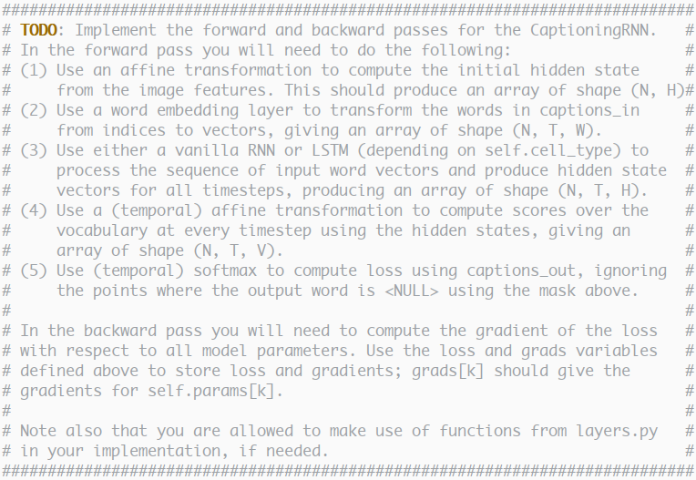

```python
# (1)
# hidden_init (N,H)
hidden_init, cache_init = affine_forward(features, W_proj, b_proj)
# (2)
# captions_in_init = W[captions_in, :] (N, T, D)
# 把所有输入的captions_in(都是以数字表示词的位置,词的位置在(0,V))
# 补充上了对应的词向量(词在单词表中的分布概率)
captions_in_init, cache_embed = word_embedding_forward(captions_in, W_embed)
# (3)
# 这里的RNN所预测的实际上是对于t时刻而言,t+1时刻大概率会出现的单词(也就是o(t))
if self.cell_type == 'rnn':
	hidden_rnn, cache_rnn = rnn_forward(captions_in_init, hidden_init, Wx, Wh, b)
else:
	hidden_rnn, cache_rnn = lstm_forward(captions_in_init, hidden_init, Wx, Wh, b)
# (4)
# 将隐藏层的维度调整映射到词汇表大小上
scores, cache_scores = temporal_affine_forward(hidden_rnn, W_vocab, b_vocab)
# (5)
# 计算各个时间步上的各个样本的分布得分对应的损失
# 最优化目标就是降低这个损失,也就是让得分的分布更加趋近于真实的选择分布
# 疑问:
# 输入的cpations_in与captions_out划分的必要是什么?
# 为什么captions_in(输入)要去掉最后一个时间步?
# 为什么captions_out(用来衡量效果的真实标签)要去掉第一个时间步?
# 因为使用当前来输出预测序列的下一个词汇(真实值)
loss, dscores = temporal_softmax_loss(scores, captions_out, mask)
# RNN实际上就是通过利用的输入的图像特征以及真实的描述序列,依次从上一词猜测符合特征的下一个词汇表述
# 表述的越准确(与真实描述一致),损失越低.
# (4)
dhidden_rnn, grads['W_vocab'], grads['b_vocab'] = temporal_affine_backward(
    dscores, cache_scores
)
# (3)
if self.cell_type == 'rnn':
	dcaptions_in_init, dhidden_init, grads['Wx'], grads['Wh'], grads['b'] = \
	rnn_backward(dhidden_rnn, cache_rnn)
else:
	dcaptions_in_init, dhidden_init, grads['Wx'], grads['Wh'], grads['b'] = \
	lstm_backward(dhidden_rnn, cache_rnn)
# (2)
grads['W_embed'] = word_embedding_backward(dcaptions_in_init, cache_embed)
# (1)
dfeatures, grads['W_proj'], grads['b_proj'] = \
affine_backward(dhidden_init, cache_init)
```
#### 测试

与分类模型不同，image captioning模型在训练时和测试时表现得非常不同。

在训练时，我们可以访问真实词，因此我们在每个时间步长将真实词作为输入提供给RNN。

在测试时，我们从每个时间步的词汇表中的分布进行采样，并在下一个时间步将样本作为输入馈送到RNN。

>  At each timestep, we embed the current word, pass it and the previous hidden state to the RNN to get the next hidden state, **use the hidden state to get scores for all vocab words, and choose the word with the highest score as the next word.** 
>
> The initial hidden state is computed by applying an affine transform to the input image features, and the initial word is the <START> token.

```python
for split in ['train', 'val']:
    minibatch = sample_coco_minibatch(small_data, split=split, batch_size=2)
    gt_captions, features, urls = minibatch
    gt_captions = decode_captions(gt_captions, data['idx_to_word'])

    sample_captions = small_rnn_model.sample(features)
    sample_captions = decode_captions(sample_captions, data['idx_to_word'])

    for gt_caption, sample_caption, url in zip(gt_captions, sample_captions, urls):
        plt.imshow(image_from_url(url))
        plt.title('%s\n%s\nGT:%s' % (split, sample_caption, gt_caption))
        plt.axis('off')
        plt.show()
```

这里的使用的sample()方法只有单程,实现如下:

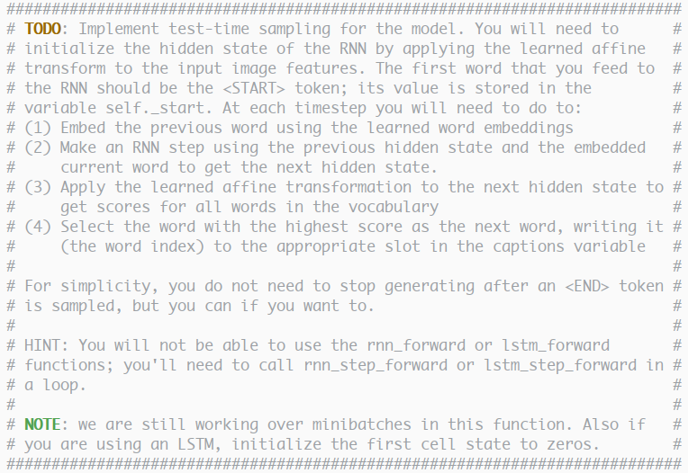

```python
hidden_init, _ = affine_forward(features, W_proj, b_proj)
# (1)
start_word_embed, _ = word_embedding_forward(self._start, W_embed)
hidden_curr = hidden_init
cell_curr = np.zeros_like(hidden_curr)

word_embed = start_word_embed

for step in range(max_length):
    # 这里的关键参数是word_embed,将前一步的预测结果作为输入到下一步.
    # (2)
    if self.cell_type == 'rnn':
        hidden_curr, _ = rnn_step_forward(word_embed, hidden_curr, Wx, Wh, b)
        else:
            hidden_curr, cell_curr, _ = \
            lstm_step_forward(word_embed, hidden_curr, Wx, Wh, b)
            # (3)
            step_scores, _ = affine_forward(hidden_curr, W_vocab, b_vocab)
            # (4)
            #选择得分最大的词作为下一个描述用词
            captions[:, step] = np.argmax(step_scores, axis=1)
            # W_embed 表示的是对应位置上(W_embed[0][:])单词列表中的各个单词所对应的词向量
            # 将得到的词汇索引,转化为对应的词向量
            # 在深度学习系统中，我们通常使用向量来表示单词。
            # 词汇表中的每个单词都与一个向量相关联，这些向量将与系统的其余部分一起学习。
            word_embed, _ = word_embedding_forward(captions[:, step], W_embed)
```


## 视觉问答

(待补充)